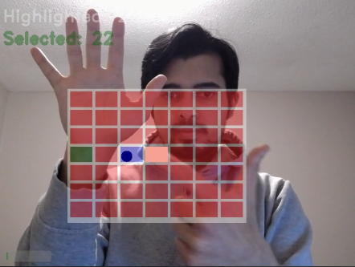
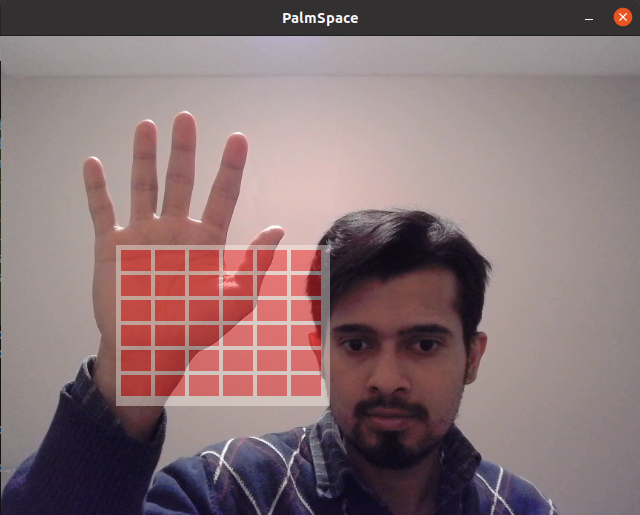
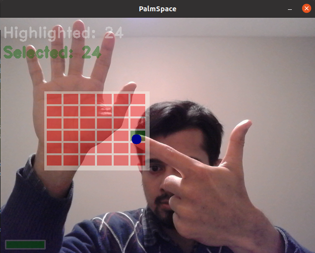

# PalmSspace
### Virtual interface for mid-air interaction
- Main project code is in the Desktop directory
  - `main.cc` initiates everything and start the application
  - `handlers` package has the MediaPipe graph and controls communication with other packages.
  - `anchors` provide interface for the grid
  - `initiator` looks for start of interaction
  - `trigger` is responsible for triggering actions
  - `ui` controls the initial display to show choices
  - `config` handles the information used by all the other packages
  
## SETUP:
- Install [MediaPipe](https://mediapipe.dev/)
- Copy the `desktop` folder into the root directory of MediaPipe which has the `WORKSPACE` file.
- may need to setup python2 for Tensorflow in third_party:
  - change symbolic link of python
    sudo rm /usr/bin/python
    sudo ln -s /usr/bin/python2 /usr/bin/python
  - [install pip2](https://linuxize.com/post/how-to-install-pip-on-ubuntu-20.04)
      - sudo apt update 
      - sudo apt install python2
      - curl https://bootstrap.pypa.io/get-pip.py --output get-pip.py
      - sudo python2 get-pip.py
  - ensure `python2.7` is present in `/usr/include`
    - sudo apt install python-dev

## Running the code:
- Open a terminal in the root directory of MediaPipe directory where the `WORKSPACE` is located.
- Running the project:
  - Use normal/default camera:
      - `make run`
  - Use RealSense camera:
      - `make rund`

<!-- ## Sample Demo
- Grid selection by waiting
-->

<!--  -->
<!--  -->
<!--  -->

## TODOS:
- Make webassembly version
- throw exception, modular func, less dependency on shared memory
- read constants from env file using config pkg
- use forward declaration, wherever possible, to speed up compilation
- use namespaces wherever possible

## NOTES:
- forward declaration (i.e. seperating declarations in header files and definintions in .cpp translation/compilation units) 
  allow faster compilation since changes to definition does not cause header file, and subsequent users of that header file, to be recompiled.
- functions are external linkage by default, const are internal linkage by default.
- extern force external linkage, static force internal linkage.
- const global variables have internal linkage by default, and non-const global variables have external linkage by default.

## Debugging
- OpenGL 3.1 downgrading to 2.0 err
    - https://dev.classmethod.jp/articles/mediapipe-process-on-aws-ec2-with-gpu/
        - comment out EGL_WINDOW_BIT in EGLint config_attr in mediapipe/gpu/gl_context_egl.cc
